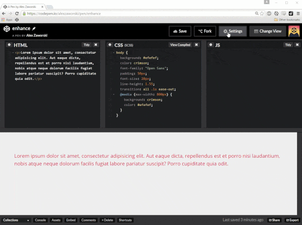
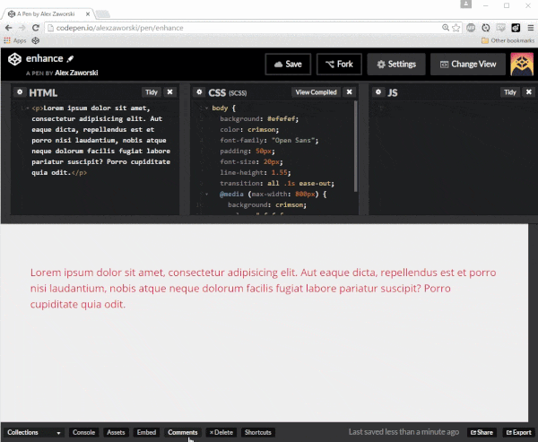
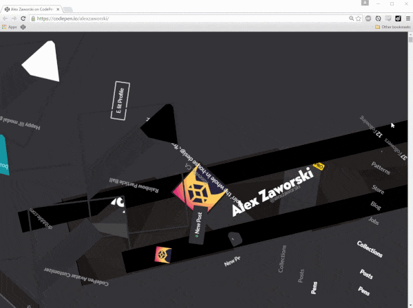

# CodePen Enhancement Suite v0.7.3

A Chrome extension meant to enhance the CodePen experience. Like [RES](https://github.com/honestbleeps/Reddit-Enhancement-Suite).

## Installation

[Available from the Chrome web store.](https://chrome.google.com/webstore/detail/codepen-enhancement-suite/olmbnbpkgkagfnkdmaehjcpdkfkfokim)

To install in dev mode:

1. `git clone`
2. [Follow these instructions](https://developer.chrome.com/extensions/getstarted#unpacked)

## Current Features

* [Custom editor themes](#custom-editor-themes)
* [Distraction Free editing mode](#distraction-free-mode)
* [Resizable Pen previews](#resizable-pen-previews)
* [Easily see when you have new notifications](#easily-see-when-you-have-new-notifications)
* [Quick-add your Pens as an external resource](#quick-add-your-pens-as-an-external-resource)
* [On-hover profile previews](#profile-previews)
* [Access editor settings from within the Pen editor](#access-editor-settings-from-within-the-pen-editor)
* [Preview comments on Pens/Posts before submitting](#preview-comments-on-pensposts-before-submitting)
* [Toggle custom CSS on user profiles](#toggle-custom-css-on-user-profiles)

### Custom Editor Themes

Adds the ability to customize your editor theme via a GUI. Allows you to adjust the following:

* Syntax highlighting
* Background/cursor colors
* CodePen UI colors (light/dark)

### Distraction Free Mode

Adds a toggle to the "Change View" dropdown in the Pen editor to enable Distraction Free Mode

### Resizable Pen Previews

Adds a draggable handle in the `Editor View` while using the `Top` layout that allows you to change the size of your Pen, making the experience of debugging responsive Pens a lot more pleasant. 

### Easily see when you have new notifications

Adds a small visiual indicator when new items are added to your activity feed.

### Quick-Add Your Pens as an External Resource

Adds your most recent public Pens to the CSS/JS typeaheads.

Want to quickly filter out your Pens? Just search `::`.

### Profile Previews

Hover over a profile link for more details on that user. Currently works in the following places:

### Access Editor Settings from Within the Pen Editor

Adds another tab to the `Pen Settings` modal that lets you change current theme/font/font size. Only works if you're using the editor over HTTPS.

### Preview Comments on Pens/Posts Before Submitting

Pretty straightforward. Relies on CodePen's internal markdown processing to generate previews which is kinda neat. It won't compile @username links, but most everything else works.

### Toggle Custom CSS on User Profiles

CodePen users can be pretty creative. Sometimes _too_ creative. This lets you turn off a user's custom profile CSS with a toggle switch.

## Why Didn't You Do (Thing)?

(Thing) sounds like a really good idea. Open an issue and I'll see what I can do. Any bug reports are welcome too, please contribute!
